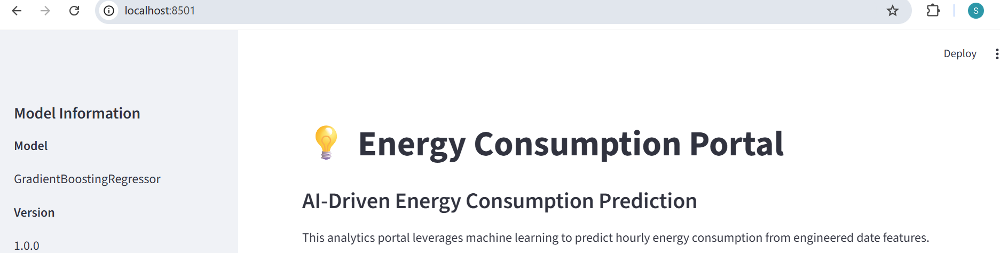
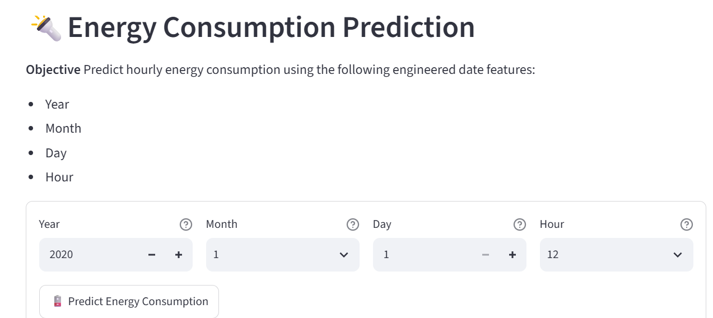
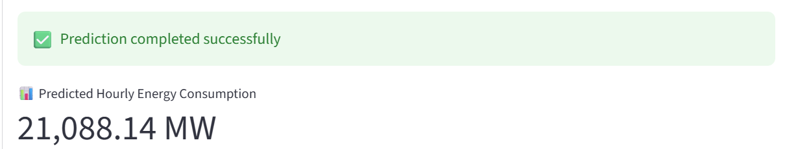
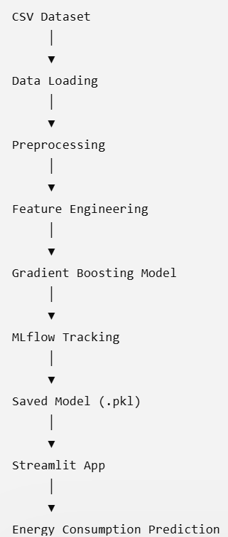

# Energy Consumption Prediction: End-to-End Machine Learning Pipeline

## Project Overview

This project is an end-to-end machine learning pipeline for forecasting hourly energy consumption using a **Gradient Boosting Regressor**. It follows machine learning engineering best practices, including modular pipeline design, feature engineering, hyperparameter optimization with Optuna, experiment tracking using MLflow, containerization with Docker, and deployment through a Streamlit web application for real-time predictions.

---

## Business Objective

The objective of this project is to accurately predict hourly energy consumption using engineered time-based features extracted from historical energy usage data.

Accurate energy consumption forecasting supports:

* Smart grid management
* Energy optimization
* Building energy management
* Utility demand planning
* Cost reduction
* Sustainability initiatives

### Home page


### Prediction


### Result


### architecture



## Architecture

The project follows a modular machine learning workflow:

**Load Data → Preprocess → Feature Engineering → Train → Hyperparameter Tune → Evaluate → Inference → Deploy**

Each stage is implemented as an independent pipeline, making the project scalable, maintainable, and suitable for production deployment.

---

## Core Modules

### `src/feature_pipeline/`

Responsible for data ingestion, preprocessing, and feature engineering.

**load.py**

* Loads the dataset
* Performs chronological train/evaluation/holdout splitting:

  * Training: **2004–2011**
  * Evaluation: **2012–2015**
  * Holdout Test: **2016–2018**

**preprocess.py**

* Cleans the dataset
* Removes outliers
* Performs preprocessing operations

**feature_engineering.py**

Generates time-based features such as:

* Hour
* Day
* Month
* Day of Week
* Quarter
* Year
* Other calendar-based features

---

### `src/training_pipeline/`

Responsible for model development and optimization.

**train.py**

* Trains a baseline Gradient Boosting Regressor
* Supports configurable model parameters

**tune.py**

* Performs Optuna-based hyperparameter optimization
* Tracks experiments using MLflow

**eval.py**

Evaluates model performance using regression metrics such as:

* RMSE
* MAE
* R² Score

---

### `src/inference_pipeline/`

Responsible for production inference.

**inference.py**

* Loads the trained model
* Applies the same preprocessing and feature engineering pipeline
* Generates predictions for new observations

---

## Web Application

The project includes a Streamlit web application for interactive energy consumption prediction.

Features include:

* Real-time energy consumption prediction
* User-friendly interface
* Fast inference using the trained production model

## Project Structure

```text
energy-consumption-prediction/
│
├── mlruns/
├── models/
├── notebooks/
├── src/
│   ├── app/
│   ├── data/
│   ├── feature_pipeline/
│   ├── inference_pipeline/
│   ├── training_pipeline/
│   └── utils/
│
├── requirements.txt
└── README.md
```

---

## How to Run the Project

### 1. Clone the repository

```bash
git clone https://github.com/alaojal/energy-consumption-prediction.git
```

### 2. Navigate to the project directory

```bash
cd energy-consumption-prediction
```

### 3. Create a virtual environment

```bash
python -m venv .venv
```

### 4. Activate the virtual environment

**Windows**

```bash
.venv\Scripts\activate
```

**macOS/Linux**

```bash
source .venv/bin/activate
```

### 5. Install the project dependencies

```bash
pip install -r requirements.txt
```

### 6. Launch the Streamlit application

```bash
streamlit run src/app/app.py
```

---

## Author

**Sheriff Ajala**

Machine Learning Engineer | Data Scientist | Operations Analytics Professional

📧 Email: [alaoajala@yahoo.com](mailto:alaoajala@yahoo.com)

🐙 GitHub: https://github.com/alaojal
